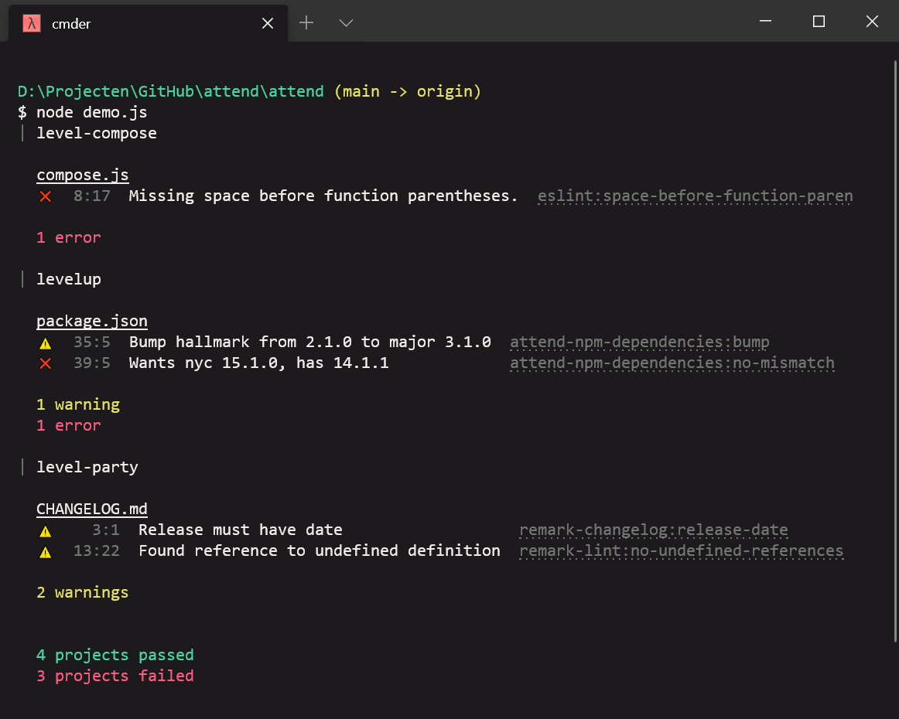

# attend (alpha)

**Automate maintenance tasks across many repositories.**

[](https://www.npmjs.org/package/attend)
[](https://www.npmjs.org/package/hallmark)
[](https://standardjs.com)



## Highlights :sparkles:

- Loosely coupled plugins: their input is a directory, output is an array of affected files
- Run plugins on multiple repositories at once
- A plugin can export one or more (ideally idempotent) functions:
  - `init()`: create something from scratch (à la yeoman and npm init)
  - `lint()`: find issues
  - `fix()`: fix issues
- Output is [vfile](https://github.com/vfile/vfile)-based, where every message has an associated source code position
  - For example, `attend-npm-dependencies` will show the line number of an outdated dependency in `package.json`

## Example

Upgrade `hallmark` in multiple GitHub repositories, fix their markdown, run tests and create a pull request:

```js
const attend = require('attend')

const suite = attend()
 .use(require('attend-project-clone'), 'vweevers/keyspace')
 .use(require('attend-project-clone'), 'Level/abstract-leveldown')
 .use(require('attend-project-clone'), 'Level/compose')
 .use(require('attend-npm-initial-install'))
 .use(require('attend-npm-dependencies'), { only: ['hallmark'], bump: true })
 .use(require('attend-hallmark'))
 .use(require('attend-npm-test'))

async function main () {
  // Or await suite.lint()
  await suite.fix({
    branch: 'attend/hallmark-3.1.0',
    commit: 'Bump hallmark to 3.1.0',
    pr: 'Bump hallmark to 3.1.0'
  })
}

main()
```

Upgrade `standard` in the working directory (the default if you don't use a project plugin):

```js
const attend = require('attend')

const suite = attend()
 .use(require('attend-npm-dependencies'), { only: ['standard'], bump: true })
 .use(require('attend-standard'))
 .use(require('attend-npm-test'))

async function main () {
  await suite.fix()
}

main()
```

## Ideas

- features:
  - [ ] `attend-repl-input` (take input for init steps)
  - [ ] `attend-cli` (wrap plugin in cli)
  - [ ] run in github actions, (auto-?)convert reports to status check annotations
  - [ ] allow replacing `attend-reporter`
- helpers:
  - [x] `branch(name)`
  - [x] `commit(message)`
    - [x] `git add -A` for convenience
    - [x] Do nothing if nothing changed
    - [ ] Amend previous commit if message is the same (and ours)
  - [x] `pr(title)`
    - [ ] Add rc for github token
  - [ ] `rebase()`
  - [ ] `execFile()` and `exec()`
- projects:
  - [x] `attend-project-clone` (clone github repo by slug)
  - [x] `attend-org-projects` (clone all github repos from org or user)
- plugins:
  - js:
    - [x] `attend-npm-initial-install` (do npm install after cloning)
    - [x] `attend-npm-dependencies` (wrap `npm-check`)
    - [x] `attend-npm-test`
    - [ ] `attend-npm-package` (create new package, lint and fix it)
      - [ ] `attend-npm-package-license` (create license)
      - [ ] `attend-npm-package-readme` (create readme)
    - [ ] `attend-npm-package-sort` (sort deps etc)
    - [ ] `attend-npm-dependency` (add one or more dependencies)
    - [x] `attend-standard` (wrapper to convert report)
    - [ ] `attend-dependents` (canary testing)
    - [ ] `attend-npm-ignore`
    - [ ] `attend-npm-audit`
    - [ ] `attend-npm-unpublished` (warn if old changes are unpublished)
    - [ ] `attend-test-framework` (e.g. warn if mocha)
  - github:
    - [ ] `attend-github-unpushed`
      - if dirty: not ok
      - if `git fetch` fails: error
      - if `git diff --shortstat <branch> origin/<branch>` has output: not ok
    - [x] `attend-github-labels` (sync labels with a preset)
    - [ ] `attend-github-access`
    - [ ] `attend-github-branch-protection`
    - [ ] `attend-github-stale-issues`
  - git:
    - [ ] `attend-git` (just init)
    - [ ] `attend-git-ignore`
    - [ ] `attend-git-version-tags` (semver-validate tags starting with v)
    - [ ] `attend-git-stale-branches`
    - [ ] `attend-git-branch-mergeable`
    - [ ] `attend-git-main` (rename master to main)
  - markdown:
    - [x] `attend-hallmark`
  - ci:
    - [x] `attend-dependabot` (create dependabot.yml, lint and fix)
    - [ ] `attend-migrate-travis-org-to-com`
    - [ ] `attend-migrate-travis-to-actions`

## Usage

## Presets

A set of plugins can be reused like so:

```js
const preset = attend()
 .use(require('attend-npm-dependencies'), { bump: true })
 .use(require('attend-npm-test'))

const suite = attend()
  .use(require('attend-project-clone'), 'vweevers/keyspace')
  .use(require('attend-project-clone'), 'Level/abstract-leveldown')
  .use(require('attend-project-clone'), 'Level/compose')
  .use(preset)
```

## Suitable for

- Trunk-based development (single git branch)
- Node.js, no other runtimes or languages for now
- Not monorepos
